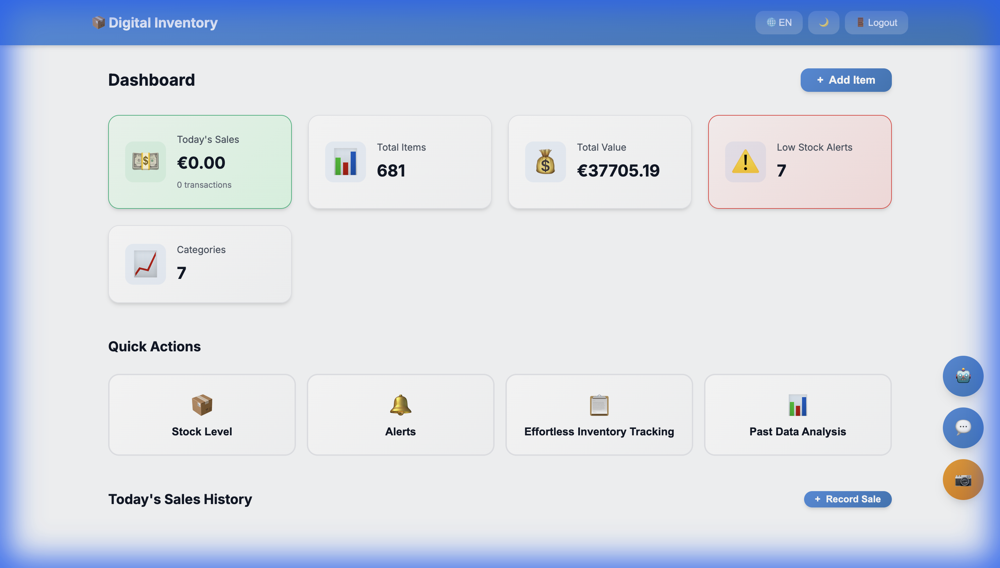
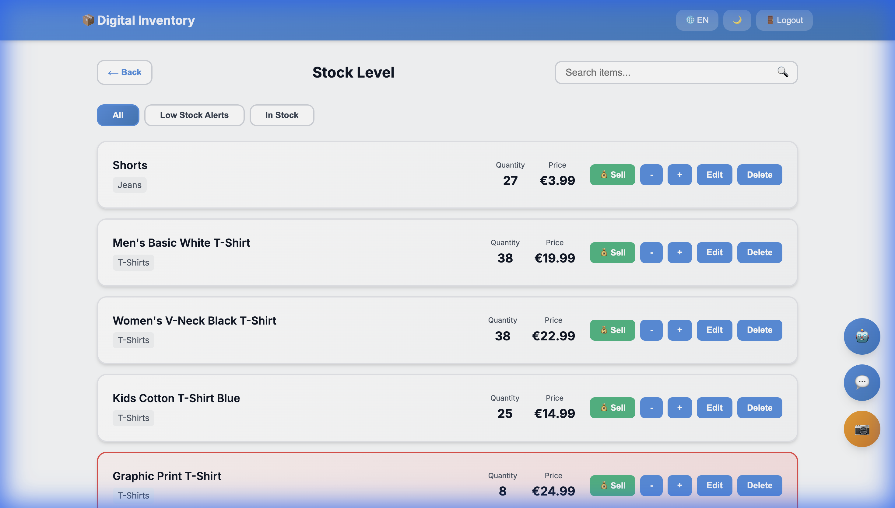
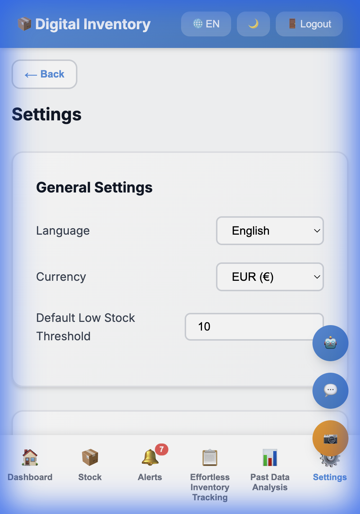
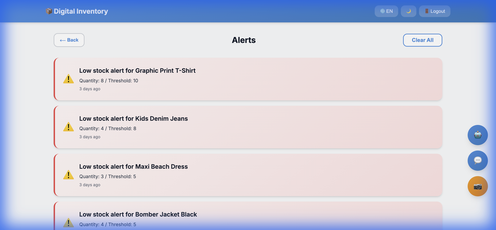

# 📦 Digital Inventory Management System

<div align="center">


**A modern, professional full-stack inventory management application designed for micro-retailers and small businesses**

[Features](#-key-features) • [Screenshots](#-screenshots) • [Quick Start](#-quick-start) • [Documentation](#-api-documentation)

</div>

---

## ✨ Key Features

### 🎯 Core Functionality
- **Real-time Dashboard** - Comprehensive overview with live stats, sales tracking, and alerts
- **Smart Stock Management** - Quick stock adjustments with intuitive +/- controls
- **Advanced Analytics** - Category breakdowns, trends analysis, and top performers
- **Dynamic Alerts** - Automatic low-stock notifications with customizable thresholds
- **Sales Tracking** - Record and monitor daily sales transactions with revenue analytics

### 💎 Professional Features
- **Beautiful UI/UX** - Modern glassmorphism design with smooth animations
- **Loading States** - Professional loading overlays during all operations
- **Toast Notifications** - Real-time success/error feedback for user actions
- **Dark Mode** - Elegant dark theme for reduced eye strain
- **Multilingual** - Full support for English and German
- **Responsive Design** - Optimized for desktop, tablet, and mobile devices
- **Data Management** - Secure export/import functionality for inventory backup
- **Search & Filter** - Fast search with multiple filter options

### 🔒 Security & Performance
- Helmet.js security headers
- Rate limiting protection
- JWT authentication
- Request compression
- Input validation
- Error handling middleware

---

## 📸 Screenshots

### Dashboard - Command Center

*Real-time overview with sales tracking, inventory stats, low-stock alerts, and quick actions*

### Stock Management - Quick Adjustments

*Intuitive stock control with +/- buttons, search, filters, and instant sell functionality*

### Inventory Management - Complete Control

*Comprehensive table view with full CRUD operations and data export/import*

### Analytics - Data Insights

*Visual analytics with category breakdowns, trends, and top items by value*

### Settings - Customization

*Personalize language, currency, alerts, and manage data*

### Alerts - Never Run Out

*Automatic low-stock notifications to keep your business running smoothly*

---

## 🚀 Quick Start

### Prerequisites

- **Node.js** v14.0 or higher ([Download](https://nodejs.org/))
- **npm** (comes with Node.js)

### Installation

1. **Clone the repository**
   ```bash
   git clone https://github.com/Siddharthpatni/Digital_Inventory.git
   cd Digital_Inventory
   ```

2. **Install dependencies**
   ```bash
   npm install
   ```

3. **Start the server**
   ```bash
   npm start
   ```

4. **Access the application**
   ```
   Open your browser and navigate to: http://localhost:3000
   ```

5. **Login with demo credentials**
   ```
   Username: admin
   Password: admin123
   ```

> **⚠️ Important:** Change the default admin password in production!

---

## 📁 Project Structure

```
digital-inventory/
├── server/                      # Backend code
│   ├── index.js                # Express server setup
│   ├── routes/
│   │   └── api.js              # RESTful API endpoints
│   ├── models/
│   │   └── database.js         # SQLite database operations
│   └── middleware/
│       ├── logger.js           # Request logging
│       ├── auth.js             # JWT authentication
│       └── errorHandler.js     # Error handling
├── public/                      # Frontend code
│   ├── index.html              # Main application
│   ├── css/
│   │   └── styles.css          # Modern styling with CSS variables
│   └── js/
│       ├── app.js              # Core application logic
│       ├── ai-assistant.js     # AI chat features
│       ├── barcode-scanner.js  # Barcode scanning
│       └── support.js          # Customer support chat
├── data/                        # Database storage
│   └── inventory.db            # SQLite database (auto-created)
├── docs/                        # Documentation and screenshots
│   └── screenshots/            # Application screenshots
├── .env.example                # Environment variables template
├── .gitignore                  # Git ignore rules
├── package.json                # Project dependencies
└── README.md                   # This file
```

---

## 🔧 Configuration

### Environment Variables

Create a `.env` file in the root directory:

```env
PORT=3000
NODE_ENV=development
JWT_SECRET=your-secret-key-here
RATE_LIMIT_WINDOW_MS=900000
RATE_LIMIT_MAX_REQUESTS=100
CORS_ORIGIN=*
```

---

## 📚 API Documentation

### Authentication
All API endpoints require JWT authentication. Include the token in the Authorization header:
```
Authorization: Bearer <your-jwt-token>
```

### Inventory Management

| Method | Endpoint | Description |
|--------|----------|-------------|
| `GET` | `/api/inventory` | Get all inventory items |
| `GET` | `/api/inventory/:id` | Get single item by ID |
| `POST` | `/api/inventory` | Create new inventory item |
| `PUT` | `/api/inventory/:id` | Update existing item |
| `DELETE` | `/api/inventory/:id` | Delete inventory item |

### Alerts Management

| Method | Endpoint | Description |
|--------|----------|-------------|
| `GET` | `/api/alerts` | Get all low-stock alerts |
| `POST` | `/api/alerts/refresh` | Refresh alert system |
| `DELETE` | `/api/alerts` | Clear all alerts |

### Sales Tracking

| Method | Endpoint | Description |
|--------|----------|-------------|
| `POST` | `/api/sales` | Record a new sale |
| `GET` | `/api/sales/today` | Get today's sales summary |
| `GET` | `/api/sales/daily?date=YYYY-MM-DD` | Get sales for specific date |

### Settings

| Method | Endpoint | Description |
|--------|----------|-------------|
| `GET` | `/api/settings` | Get user preferences |
| `PUT` | `/api/settings` | Update user settings |

### Data Management

| Method | Endpoint | Description |
|--------|----------|-------------|
| `GET` | `/api/export` | Export all data as JSON |
| `POST` | `/api/import` | Import data from JSON |

---

## 💻 Development

### Run in Development Mode

```bash
npm run dev
```

This uses `nodemon` for auto-reloading on file changes.

### Initialize Database

```bash
npm run init-db
```

---

## 🎨 Technology Stack

### Backend
- **Express.js** - Fast, minimalist web framework
- **SQLite** - Lightweight, file-based database
- **JWT** - Secure authentication
- **Bcrypt** - Password hashing
- **Helmet** - Security headers
- **Morgan** - HTTP request logger
- **CORS** - Cross-origin resource sharing
- **Express Rate Limit** - API rate limiting

### Frontend
- **Vanilla JavaScript** - No frameworks, pure performance
- **Modern CSS3** - CSS variables, animations, gradients
- **Google Fonts (Inter)** - Professional typography
- **Quagga.js** - Barcode scanning capability

---

## 🌟 Key Features Explained

### Professional UI/UX
- **Loading Overlays**: Every action shows a professional loading spinner with contextual messages
- **Toast Notifications**: Success, error, warning, and info messages appear elegantly
- **Smooth Animations**: Carefully crafted transitions and hover effects
- **Glassmorphism**: Modern frosted-glass aesthetic with backdrop blur
- **Responsive Tables**: Inventory tables adapt beautifully to any screen size

### Sales Management
- **Quick Sell**: One-click sale recording directly from stock view
- **Daily Tracking**: Automatic daily revenue and transaction counting
- **Sales History**: View all sales transactions with timestamps
- **Automatic Inventory Updates**: Stock adjusts automatically when sales are recorded

### Smart Alerts
- **Threshold-based**: Customize low-stock thresholds per item
- **Real-time Updates**: Alerts refresh automatically
- **Visual Indicators**: Color-coded warnings throughout the app
- **Badge Notifications**: Alert count displayed on navigation

---

## 📱 Browser Support

- ✅ Chrome (recommended)
- ✅ Firefox
- ✅ Safari
- ✅ Edge
- ✅ Opera

---

## 🐛 Troubleshooting

### Common Issues

**Server won't start**
- Ensure port 3000 is available
- Check that Node.js v14+ is installed: `node --version`
- Delete `node_modules` and run `npm install` again

**Database errors**
- Delete `data/inventory.db` and restart the server
- Run `npm run init-db` to reinitialize

**Can't login**
- Use default credentials: `admin` / `admin123`
- Check browser console for errors

**Stock not updating**
- Check browser console for API errors
- Verify server is running and accessible
- Clear browser cache and reload

---

## 🤝 Contributing

Contributions are welcome! Please follow these steps:

1. Fork the repository
2. Create a feature branch (`git checkout -b feature/AmazingFeature`)
3. Commit your changes (`git commit -m 'Add some AmazingFeature'`)
4. Push to the branch (`git push origin feature/AmazingFeature`)
5. Open a Pull Request

### Coding Standards
- Use ES6+ JavaScript features
- Follow existing code style and formatting
- Add comments for complex logic
- Test all changes thoroughly

---

## 📝 License

This project is licensed under the **MIT License** - see the [LICENSE](LICENSE) file for details.

```
MIT License

Copyright (c) 2024 Digital Inventory

Permission is hereby granted, free of charge, to any person obtaining a copy
of this software and associated documentation files (the "Software"), to deal
in the Software without restriction, including without limitation the rights
to use, copy, modify, merge, publish, distribute, sublicense, and/or sell
copies of the Software, and to permit persons to whom the Software is
furnished to do so, subject to the following conditions:

The above copyright notice and this permission notice shall be included in all
copies or substantial portions of the Software.

THE SOFTWARE IS PROVIDED "AS IS", WITHOUT WARRANTY OF ANY KIND, EXPRESS OR
IMPLIED, INCLUDING BUT NOT LIMITED TO THE WARRANTIES OF MERCHANTABILITY,
FITNESS FOR A PARTICULAR PURPOSE AND NONINFRINGEMENT. IN NO EVENT SHALL THE
AUTHORS OR COPYRIGHT HOLDERS BE LIABLE FOR ANY CLAIM, DAMAGES OR OTHER
LIABILITY, WHETHER IN AN ACTION OF CONTRACT, TORT OR OTHERWISE, ARISING FROM,
OUT OF OR IN CONNECTION WITH THE SOFTWARE OR THE USE OR OTHER DEALINGS IN THE
SOFTWARE.
```

---

## 📧 Support

For questions, issues, or feature requests:
- 🐛 **Bug Reports**: [Open an issue](https://github.com/Siddharthpatni/Digital_Inventory/issues)
- 💡 **Feature Requests**: [Submit a request](https://github.com/Siddharthpatni/Digital_Inventory/issues/new)
- 📖 **Documentation**: Check this README first

---

## 🙏 Acknowledgments

- Font: [Inter](https://fonts.google.com/specimen/Inter) by Rasmus Andersson
- Icons: Emoji icons for universal compatibility
- Inspiration: Modern SaaS applications and micro-retail needs

---

## 🗺️ Roadmap

- [ ] Multi-user support with role-based access
- [ ] Advanced reporting with PDF export
- [ ] Email notifications for alerts
- [ ] Barcode generation and printing
- [ ] Mobile app (React Native)
- [ ] Cloud sync and backup
- [ ] Supplier management
- [ ] Purchase order tracking

---

<div align="center">

**Built with ❤️ for small businesses and entrepreneurs**

⭐ Star this repository if you find it helpful!

[Report Bug](https://github.com/Siddharthpatni/Digital_Inventory/issues) · [Request Feature](https://github.com/Siddharthpatni/Digital_Inventory/issues/new)

</div>
